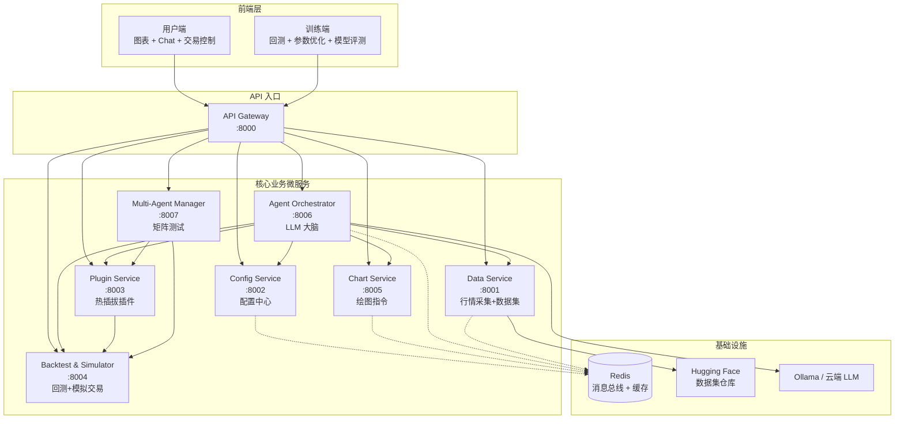
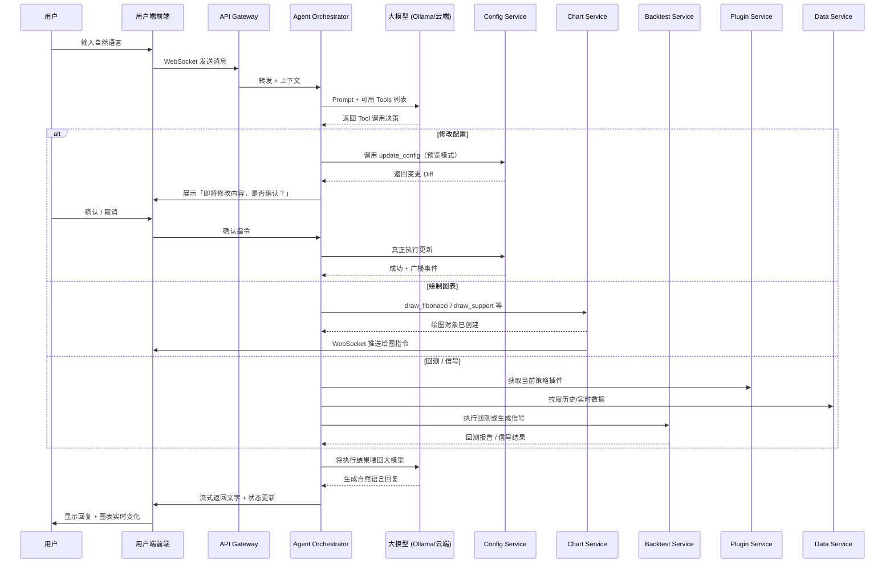
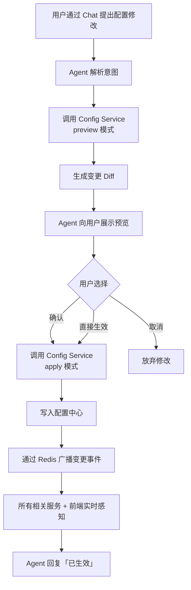
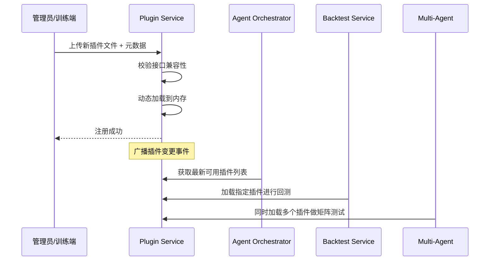
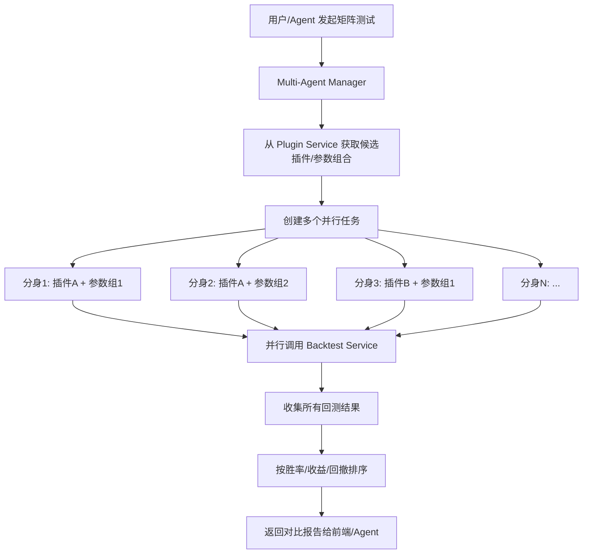
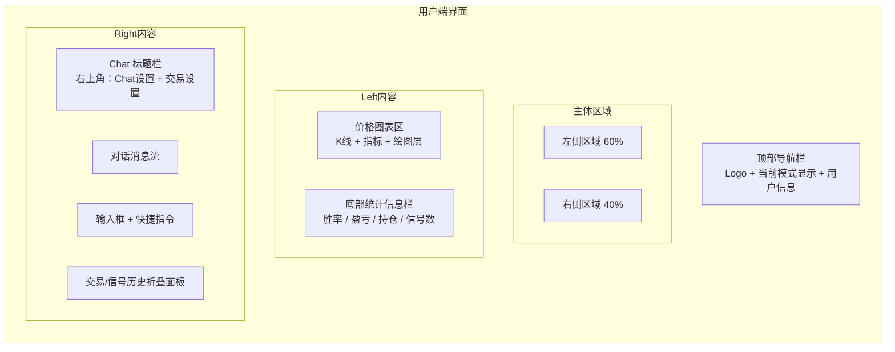
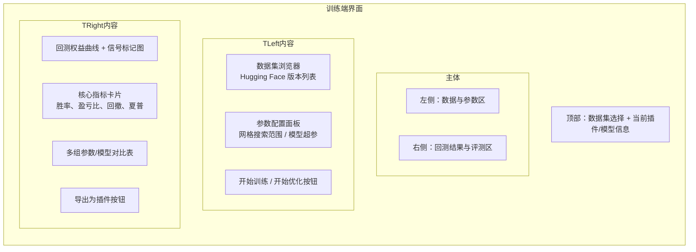
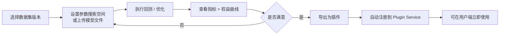

# 加密市场自主 Agent 系统  
## 完整微服务架构 + 模型训练 + 前端设计流程图

> 本文档是项目核心设计文档，包含：  
> 1. 微服务整体架构与数据流  
> 2. 在线运行（Chat + LLM）完整流程  
> 3. 离线训练与插件热加载流程  
> 4. 关键交互流程细化  
> 5. 前端双端设计建议（用户端 + 训练端）

---

## 一、微服务整体架构图



---

## 二、在线运行核心流程（用户 Chat 对话）

### 2.1 整体时序图



### 2.2 配置修改「预览-确认-生效」流程



---

## 三、离线训练与模型全生命周期

### 3.1 数据 → 训练 → 插件完整流程

```mermaid
flowchart TD
    subgraph 数据采集
        A1[Data Service 定时任务<br/>每 5 分钟] --> A2[拉取 Binance 5m K线]
        A2 --> A3[数据清洗 + 增量存储]
        A3 --> A4[特征工程<br/>RSI/KDJ/MACD/波动率等]
        A4 --> A5[生成带标签数据集]
        A5 --> A6[上传 Hugging Face<br/>版本化]
    end

    subgraph 模型训练（训练端）
        B1[从 Hugging Face 拉取数据集] --> B2[选择训练方式]
        B2 --> B3[参数网格/贝叶斯优化]
        B2 --> B4[训练轻量模型<br/>分类/回归/规则]
        B3 --> B5[产出最优参数文件]
        B4 --> B6[产出模型文件<br/>.pkl / .joblib / .onnx]
        B5 --> B7[本地回测验证]
        B6 --> B7
        B7 --> B8{评测是否通过}
        B8 -->|通过| B9[打包为插件]
        B8 -->|不通过| B2
    end

    subgraph 插件上线
        C1[上传插件到 Plugin Service] --> C2[注册元数据<br/>名称/版本/支持模式]
        C2 --> C3[热加载完成]
        C3 --> C4[可被 Agent / 回测 / 多分身使用]
    end

    A6 --> B1
    B9 --> C1
```

### 3.2 插件热插拔流程



---

## 四、多分身矩阵测试流程



---

## 五、前端设计建议

### 5.1 用户端（User Client）整体布局



#### 用户端功能分区说明

| 区域 | 功能点 | 交互说明 |
|------|--------|----------|
| **价格图表区** | K线、技术指标叠加、支撑压力位、斐波那契、信号标记 | 支持 Chat 驱动绘图，也可手动工具栏操作 |
| **Chat 对话区** | 自然语言交互 | 右上角两个按钮：Chat设置、交易设置 |
| **Chat设置** | 模型选择（Ollama/云端）、温度、系统提示词、确认模式开关 | 弹窗或抽屉 |
| **交易设置** | 当前模式（永续/事件/双模式）、启用插件、风险参数、自动平仓开关 | 弹窗，修改后走确认流程 |
| **信号/交易历史** | 历史信号列表、模拟成交记录、盈亏曲线 | 可展开/折叠，支持筛选 |
| **统计信息** | 实时胜率、累计收益、最大回撤、当前持仓、今日信号数 | 图表下方常驻 |

#### 用户端关键交互流程建议

1. **Chat 修改交易模式**：
   - 用户说「切换到事件合约30分钟」
   - Chat 显示预览卡片 → 用户点确认 → 顶部模式标签实时变化 + 图表刷新

2. **Chat 绘图**：
   - 用户说「从昨天低点到今天高点画斐波那契」
   - 图表自动出现斐波那契线，Chat 回复「已绘制」

3. **信号展示**：
   - 新信号产生时，图表上打点 + Chat 推送卡片 + 历史列表新增一条

---

### 5.2 训练端（Training Client）整体布局



#### 训练端核心功能

| 功能 | 说明 |
|------|------|
| **数据集管理** | 浏览 Hugging Face 上的版本化数据集，一键拉取到本地 |
| **参数测试** | 支持单组参数手动回测 + 网格/贝叶斯批量优化 |
| **模型评测** | 上传已有模型文件，针对指定时间段回测，输出完整报告 |
| **可视化对比** | 多组参数或不同模型的权益曲线叠加对比 |
| **一键转插件** | 评测通过后，直接打包并注册到 Plugin Service |

#### 训练端推荐工作流



---

## 六、前后端协作关键接口建议（简要）

### 用户端主要依赖接口
- `WS /ws/chat`：Chat 流式对话
- `WS /ws/chart`：绘图指令推送
- `WS /ws/config`：配置变更广播
- `GET /api/v1/signals/history`：信号历史
- `GET /api/v1/stats`：统计信息
- `POST /api/v1/config/preview` & `/apply`：配置预览与生效

### 训练端主要依赖接口
- `GET /api/v1/datasets`：数据集列表（来自 Data Service）
- `POST /api/v1/backtest/run`：单次回测
- `POST /api/v1/backtest/optimize`：参数优化
- `POST /api/v1/plugins/register`：注册新插件
- `GET /api/v1/plugins`：已有插件列表

---

## 七、总结：核心实现逻辑一句话

**数据持续采集 → 训练端产出并验证插件 → 插件热加载到系统 → 用户通过 Chat 指挥 LLM → LLM 调用微服务完成配置、绘图、回测、信号 → 结果实时反馈到图表与对话。**

训练与在线推理彻底分离，保证系统稳定与可复用性。

---

文档版本：v1.0  
最后更新：2026-09-04
